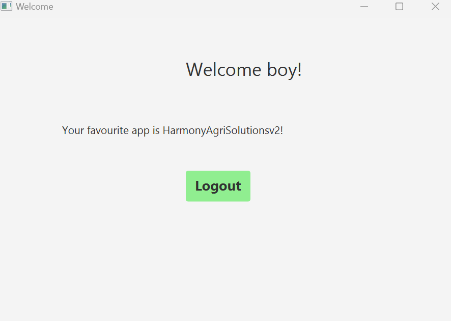
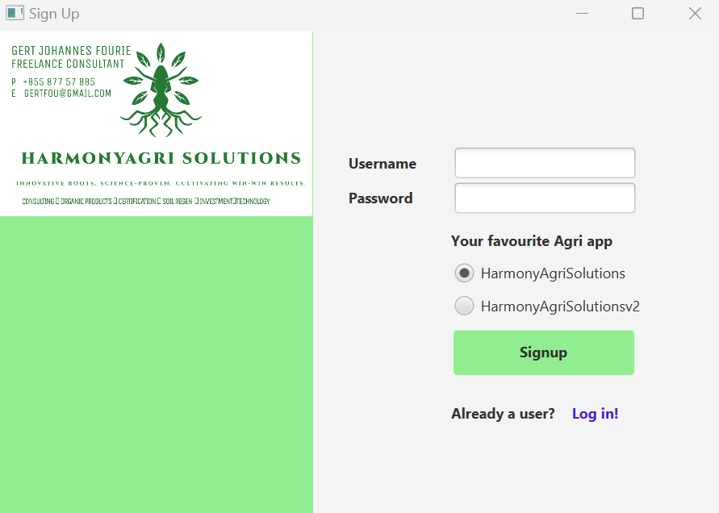
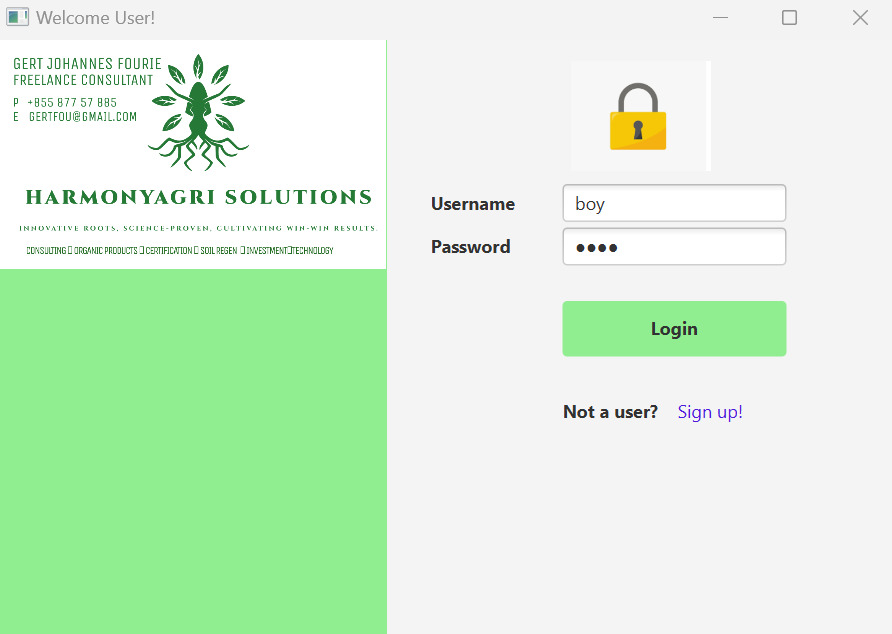

## JavaFXLoginAgriAPP
#### A small Java desktop program for logging in and signing up using, MySQL database(JDBC), Mysql workbench
#### Scenebuilder in IntelliJ, JavaFX, Maven &amp; IntelliJ IDE. 
#### Setup Java + Maven + IntelliJ https://www.youtube.com/watch?v=dgiQyx13X0M
### A) prequisites, dependancies in pom.xml file handled by Maven.
#### 1. Install IntelliJ IDE or eclipse, and and install latest JavaJDK, JAVAFX & Maven.
#### 2. Setup Mysql on your pc. Watch this you tube vid: https://www.youtube.com/watch?v=OM4aZJW_Ojs&t=321s.

### B) Use your own SQL private credentials in DBUtils.java class. 
#### URL: Mysql workbench schema jdbc:mysql://localhost:3306/schema-name". schema name that you created in mySQLworkbench
#### Username: Mysql (Created when you install it). or ManageServerConnection in mySQLworkbench username as per configuration
#### Password: Mysql (Created when you install it). 
#### You should, best practice, set up .env instead of hardcode any key or sensitive data in your project, include it in .gitignore *.env
### C) Two test files included, to test your jdbc and Mysql connection
#### Username: Mysql (Created when you install it). or ManageServerConnection in mySQLworkbench username as per configuration
#### Password: Mysql (Created when you install it). 
#### Follow this youtube vid first, https://www.youtube.com/watch?v=e8g9eNnFpHQ , and test without maven in seperate project, exactly, as is with latest drivers and it should work. Rerun with Maven and make that connection listen.  
#### Maven makes your project structure a little different with some few tweaks. 

#### other usefull vids to Fix Error: JavaFX runtime components are missing, and are required to run this application
#### https://www.youtube.com/watch?v=hS_6ek9rTco
#### notes: include: 
#### Parent root = FXMLLoader.load(getClass().getResource("second.fxml"));
#### VS
#### Parent root = FXMLLoader.load(Main.class.getClassLoader().getResource("second.fxml"))
#### Add Main class for Maven framework. 

#### D) Code along: Skip it and you will punish yourself for whats to come. https://www.youtube.com/watch?v=ltX5AtW9v30

#### pics of litte app and getting around java and mysql

